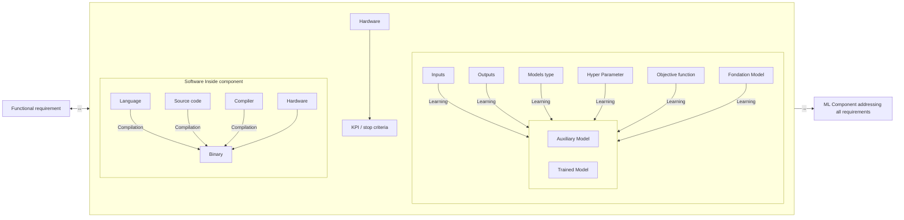

# TP instructions slides
## Evaluation : TD — Propose a component


## Slide 1 — Challenge confiance : support TP

**Basée sur le [Challenge Confiance](https://github.com/etaia/Welding-Quality-Detection-Challenge) basé sur la méthodologie et les outils Confiance**

- Le dataset Renault Welding (mis en open source)
- Un code "baseline" de référence pour les métriques de performance
- Des critères d'évaluations basées sur les résultats de Confiance.ai

### Objectif du Challenge

> **Création d'un composant IA** à partir d'images de soudures Renault, classifié en 3 classes : **OK / NOK / Unknown**

L'évaluation est basée sur la méthodologie et les outils Confiance *(Robustness, Uncertainty, Monitoring, ODD, etc.)*

### Evaluation Criteria

*The submitted AI component will be evaluated according to different quality evaluation metrics, including:*

- **Operational cost metrics** : Based on the confusion matrix and a non-symmetrical cost matrix due to operational constraints.
- **Uncertainty metrics** : Measuring the ability of the model to use uncertainty to improve trustworthiness in its output.
- **Robustness metrics** : Measuring the ability of the model to be invariant to empirical perturbations on input images (blur, luminosity, rotation, translation).
- **Monitoring metrics** : Measuring the ability of the model to detect if the given input is within the ODD and adapt its output accordingly.
- **Explainability metrics** : Measuring the ability of the model to provide an explanation for its decision to help the operator save time during inspection.

*More details about these different criteria will be added in the coming weeks.*

---

## Slide 2 — Challenge confiance : liens et ressources

**Industrial and Trustworthy AI Challenge: Welding Quality Detection**

> *Join us and engage with a real-world challenge to enhance weld quality inspection in industrial processes.*

**Liens :**
- https://github.com/etaia/Welding-Quality-Detection-Challenge
- https://etaia.github.io/Welding-Quality-Detection-Challenge/
- https://etaia.github.io/reference-environment/
- https://github.com/etaia/reference-environment

---

## Slide 3 — Contenu du TP : Architecture du composant

### Sujet

**Une proposition d'architecture de composant :**
- Le / Les modèles ML que vous imaginez utiliser
- Le / les composants logiciels que vous pensez ajouter
- Une définition précise des entrées / sorties de ces modèles / code

### Résultat attendu

- Un schéma d'architecture du composant IA **en opération**
- Un schéma d'architecture du composant IA **en entraînement**
- Un schéma d'architecture du composant IA **en évaluation**
- Un bloc markdown de description pour **chaque constituant**
- Le code Python définissant l'interface de ce composant, avec les interactions des constituants *(boite noire qui renvoie random)*

*The figure below illustrates the structure of an ML component and its constituents :*



### Forme attendue

- Une documentation avec les markdowns, et images des schémas *(ou schéma mermaid)*

### Évaluation

| Critère | Description |
|---------|-------------|
| Cohérence avec le cas d'usage | Le composant répond bien au problème posé |
| Cohérence entre les étapes | Les phases opération / entraînement / évaluation sont alignées |
| Description des constituants | Chaque module est clairement décrit |
| Validité des entrées / sorties | Les interfaces sont logiques et cohérentes |
| Originalité | Approche innovante |

---

## Slide 4 — Contenu du TP : Datasets

### Sujet

**La liste des datasets que vous allez construire, avec pour chacun :**

### Résultat attendu

- Une description de la manière de le constituer avec les paramètres prévus
  - *Exemple 1 : génération d'image avec un effet flash éblouissant de la caméra (peu pertinent pour le cas d'usage)*
  - *Exemple 2 : extraire les canards où il n'y a pas d'eau à côté*
- Identification des métadonnées associées aux échantillons du dataset créé *(ex : localisation de l'éblouissement)*
- Le code Python de l'interface qui génère / altère / sélectionne un échantillon de donnée

### Forme attendue

- Un bloc MD pour décrire **comment constituer** chaque dataset
- Un bloc MD pour décrire **l'usage prévu** de chaque dataset
- Un bloc de code pour chaque dataset pour **l'interface de création**

### Évaluation

| Critère | Description |
|---------|-------------|
| Cohérence avec le cas d'usage | Le dataset est pertinent pour le problème |
| Cohérence entre les étapes | Le dataset s'intègre dans le pipeline global |
| Description de l'usage | L'usage est clairement expliqué |
| Validité de l'interface | Le code d'interface est correct et utilisable |
| Originalité | Approche innovante |

---

## Slide 5 — Contenu du TP : KPIs

### Sujet

**La liste des KPIs que vous allez générer pour le composant IA**

### Résultat attendu

- Une description du KPI construit
  - *Exemple 1 : La robustesse du modèle au flash éblouissant*
- Identification des métadonnées associées au KPI *(quels paramètres, dimension du KPI)*
- Objectif du KPI prévu dans la démonstration de confiance
- Dans quelle(s) phase(s) ce KPI va être utilisé :
  - Construction dataset
  - Entraînement
  - Évaluation
  - Opération
- Échantillon du KPI attendu

### Forme attendue

- Un bloc MD pour décrire **comment constituer** chaque KPI
- Un bloc MD pour décrire **l'usage prévu** de chaque KPI
- Un bloc de code pour chaque dataset pour **l'interface de création**

### Évaluation

| Critère | Description |
|---------|-------------|
| Cohérence avec le cas d'usage | Le KPI mesure quelque chose de pertinent |
| Cohérence entre les étapes | Le KPI s'intègre dans le pipeline global |
| Description de l'usage | L'usage est clairement expliqué |
| Validité de l'interface | Le code d'interface est correct et utilisable |
| Originalité | Approche innovante |

---

## Slide 6 — Contenu du TP : Artefacts

### Sujet

**Les artefacts que vous envisagez de présenter pour faire valider votre composant**

### Résultat attendu

- L'agrégation / filtrage / représentation des KPIs utilisés
  - *Exemple 1 : La robustesse du modèle au flash éblouissant par type de soudure corrélée à la ... sous forme de bar graph*
- Identification de la méthode d'agrégation / contextualisation
- À qui est destiné l'artefact prévu, pour quel objectif
  - *Validation de la ... par ...*
- Dans quelle(s) phase(s) ce KPI va être utilisé *(Construction dataset, entraînement, évaluation, opération)*

### Forme attendue

- Un bloc MD pour décrire **comment constituer** chaque Artefact
- Un bloc MD pour décrire **l'usage prévu** de chaque Artefact
- Une **représentation visuelle envisagée**

### Évaluation

| Critère | Description |
|---------|-------------|
| Cohérence avec le cas d'usage | L'artefact est pertinent pour valider le composant |
| Cohérence entre les étapes | L'artefact s'intègre dans le pipeline global |
| Description de l'usage | L'usage est clairement expliqué |
| Validité de l'interface | La représentation est logique |
| Originalité | Approche innovante |

---

## Slide 7 — Forme du TP

### Rendu attendu

**Un repository Git avec l'historique des commits** — travail en binôme

### Structure du repository

```
repository/
├── Docs/
│   ├── Architecture/
│   ├── Datasets/
│   ├── KPI/
│   └── Artefacts/
└── Interfaces/
    └── (Py code for interfaces)
```

### Proposition d'outils

- Utilisation de **mkdocs** / **vitepress** pour générer un site de documentation à partir de vos markdowns
- Utiliser la représentation **mermaid** pour intégrer des schémas dans les markdowns, ou **drawio** pour la simplicité de partage via git

> → Mais vous pouvez utiliser d'autres outils pour les schémas, et intégrer les images dans le repository

---

## Récapitulatif des 4 livrables

| Livrable | Contenu | Forme |
|----------|---------|-------|
| **Architecture** | Modèles ML, composants logiciels, entrées/sorties | 3 schémas (opération / entraînement / évaluation) + MD par constituant + code Python interface |
| **Datasets** | Liste des datasets à construire | MD constitution + MD usage + code Python interface |
| **KPIs** | Liste des KPIs à générer | MD constitution + MD usage + code Python interface |
| **Artefacts** | Agrégation des KPIs pour validation | MD constitution + MD usage + représentation visuelle |

## Critères d'évaluation communs à tous les livrables

- Cohérence avec le cas d'usage
- Cohérence entre les étapes
- Description des constituants / de l'usage
- Validité des entrées / sorties / de l'interface
- Originalité (approche innovante)
