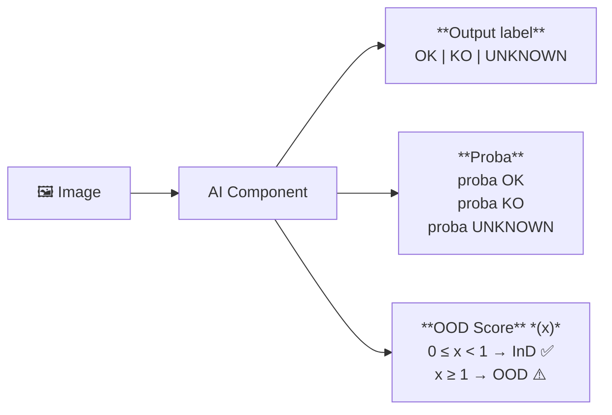

# Welding Quality Detection Challenge
*Source : https://etaia.github.io/Welding-Quality-Detection-Challenge/*

---

## Context

In the highly competitive automotive industry, quality control is essential to ensure the reliability of vehicles and user safety. A failure in quality control can severely jeopardize safety, result in significant financial costs, and cause substantial reputational damage to the company involved.

One of the challenges for Renault is to improve the reliability of quality control for welding seams in automotive body manufacturing. Currently, this inspection is consistently performed by a human operator due to the legal dimension related to user safety. During an industrial process, this task is resource-consuming. The key challenge is to develop an AI-based solution that reduces the number of inspections required by the operator through automated pre-validation.

Within the **[Confiance.ai](https://confiance.ai) Research Program**, Renault Group and SystemX worked jointly on the development of trustworthy AI components tackling this problem. Now part of the **[European Trustworthy AI Association](https://etaia.eu)**, we want to ensure that these tools effectively validate the proposed AI-Component according to the trustworthy criteria defined by the industry (Intended Purpose).

This industrial use case, provided by Renault Group, represents the "Visual Inspection" thematic through a classification problem.

The goal is to be able to assess weld quality from a photo taken by cameras on vehicle production lines.

A weld can have two distinct states:

- **OK** : The welding is normal.
- **KO** : The welding has defects.

The main objective of the challenge is to create an AI component that will assist an operator in performing weld classification while minimizing the need for the operator to inspect the images and double-check the classifications.

For defect identification ("KO"), the system should provide the operator with relevant information on the location of the detected defect in the image, hence reducing the control task duration.

---

## Expected AI Component

The AI component takes an image as input and optionally some additional metadata. Three possible outputs are possible:

| Output | Description |
|--------|-------------|
| **OK** | The welding in the image has no defect. |
| **KO** | The welding in the image has defects. |
| **UNKNOWN** | The welding state is UNKNOWN. Used to indicate that the AI-Component is not sure about the predicted class. The UNKNOWN output can be less penalizing than a False Negative (a true KO predicted as OK), which has a critical cost — but is also penalized if used in place of KO label. |

Optionally, the AI component could additionally return the **probability** associated with each possible output state. If probabilities are not provided, they will be inferred based on the label by assigning a probability of 1 to the predicted class.

The component must also produce an **OOD (Out-of-Distribution) score**. This score takes a value between 0 and +infinity. When the score is greater than or equal to 1, it indicates that the input has been detected as OOD. By default, in the absence of an OOD detection module, the OOD score can be set to 0.

*This is illustrated by the figure below:*



---

## Purpose of the Challenge

The Trustworthy AI Challenge aims to build a reliable AI component to assist in weld seam conformity qualification. This involves:

- **Developing an efficient AI component** that meets performance requirements in terms of anomaly detection, meaning high defect detection accuracy while minimizing false positives that cause time loss due to unnecessary operator verification.
- Developing a **trustworthy AI component** that meets ML trustworthiness requirements, ensuring the system can operate effectively in real-world scenarios — such as being robust to minor environmental disturbances, generalizing across datasets, expressing uncertainty, and handling anomalies.

---

## Operational Design Domain (ODD) of the AI Component

The Operational Design Domain refers to a set of business specifications defining the conditions under which the AI component must operate effectively. In our case, domain experts defined the acceptable conditions for image acquisition:

- Image **brightness** may vary.
- Image **blur** (caused by production line vibrations) may vary.
- Welding seams may appear with **rotation angles** between **-30° and +30°**.
- The **position** of the piece in the image may be **translated by up to 5 millimeters** (approximately 100 pixels, depending on seam and camera position).

> **Note :** The ODD defines the full operational range (rotation up to ±30°). The robustness evaluation, however, tests a narrower perturbation range of **[-10°, +10°]** — meaning the component is specifically stress-tested for robustness within that window, while anything beyond is considered potentially OOD.

In practice, while these conditions are helpful for guiding design and evaluation, they are not always directly exploitable. For example, creating a descriptor capable of measuring image brightness independently of background content is a non-trivial challenge.

> See **etaia_github_io_evaluation_page.md** page to get more information about how these specifications are used to evaluate your solution.

---

## Data Specificities

The dataset contains **22,753 images** split among **three different welding seams**. An important property of this dataset is that it is **highly unbalanced** : there are about **500 KO images** in the entire dataset.

Each image is considered to have only one welding present on it. You may see a secondary welding area on background of some images. In those cases, the considered welding for the image is always the main welding present on the foreground.

### Unbalanced Dataset

The dataset is highly imbalanced, with 98% of samples labeled as OK and only 2% as KO (defective). It is also slightly imbalanced between weld types:
C20: 22%
C33: 39%
C102: 39%

Some weld types may present defects that are inherently more difficult to detect than others.

### Heterogeneous Dataset

The dataset contains heterogeneous images due to several factors:

- Three different weld types are included, each with distinct shapes and backgrounds.
- For a given weld type, multiple viewpoints and capture angles exist.
- Even within a single setup, image quality varies due to lighting conditions, part positioning, or motion blur.

A simple exploratory data analysis reveals relatively “homogeneous” clusters, identified using the HDBSCAN algorithm applied on a UMAP-reduced latent space produced by a Variational Autoencoder (VAE).

A Latent reduction clustering analysis by welding seams sub sets show distinctive clusters

Visualizing blur distribution conditioned on weld type shows that blur quality varies according to the type of weld.

**Top — Histogram :** The density plot shows the blur level distribution (X-axis: blur level 0–6000, Y-axis: density) for the three training weld types. The distributions differ significantly across weld types:

- **C102** (blue) : concentrated distribution with a sharp peak around blur level ~900 — most images are relatively sharp.
- **C33** (green) : bimodal distribution with two peaks (~1000 and ~2000) — images span a wide range of blur levels.
- **C20** (orange) : flat, spread-out distribution across all blur levels — no dominant blur regime.

**Bottom — Example images :** Three rows (one per weld type, color-coded: C20 orange, C102 blue, C33 green), each showing 4 images sampled at increasing blur levels from right to left:

| No blur | Small blur | Blur | Strong blur |
|---------|------------|------|-------------|
| sharpest → | → | → | → most blurred |

> **Key insight :** Since blur distributions are not consistent across weld types, blur level alone cannot serve as a universal ODD descriptor. The AI-component must learn robustness to blur in a type-aware manner, and OOD detection cannot rely solely on a global blur threshold.

Because descriptors like blur or luminance are not invariant across heterogeneous conditions, the operational domain cannot always be explicitly modeled. Therefore, the challenge is to design an AI-component with robustness and anomaly detection capabilities that can adapt to these ill-defined variations.

> See the **etaia_github_io_dataset_page.md** to get more information about the provided datasets.

---

## AI Component Specifications and Operational Requirements

Discussions with operators and data analysis have highlighted key needs:

- **False negatives** (defective welds classified as OK) pose safety risks and must be minimized — this is the **top priority**.
- Prediction accuracy should be maximized.
- The criticality of a weld varies by location, influencing the impact of a false negative.
- Variability in image quality demands mechanisms that ensure AI-component reliability and input data validation.

### Requirements

Operational specifications can be grouped into three categories: general, performance, and trustworthy AI requirements.

### General Requirements

- The component must process three weld types: `['C20', 'C33', 'C102']`.
- Input images may vary in size, quality, and framing.
- The component must be trained on the provided weld image dataset, which may suffer from quality and representativeness issues — requiring data cleaning or augmentation.

### Performance Requirements

- High detection accuracy must be achieved with minimal false negatives.
- Operational performance evaluation will take into account the criticality of each weld type.
- Inference time must not exceed **1/12 of a second** for each image.

### Trustworthy AI Requirements

- **Robustness** : The AI-Component should be resilient to slight variations in image capture (brightness, blur, minor rotations [-10°, +10°], translations up to ~20 pixels).
- **Uncertainty Estimation** : The AI-component should provide classification probabilities and an `"unknown"` class to express indecision.
- **Generalization** : The AI-component should generalize to unseen weld types (`['C19', 'C34', 'C101']`) that share common features with training data.
- **Out-of-Distribution (OOD) Monitoring** : The AI-component must detect OOD inputs, such as images with poor visibility due to blur, occlusion, or unusual coloration.
- **Drift Handling** : The AI-component must remain robust to mild image capture degradation (e.g. Gaussian noise, dead pixels) and detect strong degradation as OOD.

---

## Trustworthy Evaluation

The goal of the trustworthy evaluation is to measure both key performance and trustworthiness indicator KPIs, assessing the AI system's ability to function reliably under real-world conditions — including robustness, generalization, uncertainty management, and anomaly detection.

The evaluation framework is based on a **multi-criteria analysis of six trust attributes** :

> **Performance** · **Uncertainty Assessment** · **Robustness** · **OOD Monitoring** · **Generalization** · **Data Drift Handling**

Each is evaluated via Trust-KPIs, which are composed of specific criteria measured using dedicated metrics. These metrics are aggregated to provide synthetic indicators that will facilitate decision-making.

Evaluation may require specific datasets — selected or synthetically generated — to simulate controlled scenarios. From the AI component's predictions on these datasets, the following KPIs will be computed:

- **Performance KPI & Metrics** — Evaluate jointly accuracy (operational and ML), inference time, and weld-type criticality sensitivity, taking into account data heterogeneity and operational specificity. Based on a standard evaluation dataset containing 20% of the data drawn to obtain a representative sample.

- **Uncertainty KPI & Metrics** — Evaluate jointly the relevance and calibration of the AI-Component's confidence estimates to ensure alignment between expressed uncertainty and actual error risk. Based on a standard evaluation dataset containing 20% of the data drawn to obtain a representative sample.

- **Robustness KPI & Metrics** — Evaluate jointly the AI-Component's ability to produce stable predictions under slight perturbations (blur, lighting, rotation, translation), in line with ODD specifications. Based on a robustness evaluation set generated from real data (chosen to be representative and of good quality) on which controlled perturbations of known magnitude are applied.

*The figure below illustrates four blur levels applied to the **same weld image**, from left to right :*

| No-blur | Low-blur | Mid-blur | ⚠️ Extrem-blur |
|---------|----------|----------|----------------|
| *(image)* | *(image)* | *(image)* | *(image)* |
| ← **within ODD** → | | | ← **outside ODD** → |

A red dashed line marks the **ODD limit** between **mid-blur** (still within the operational domain) and **extrem-blur** (considered out-of-distribution). Images beyond this threshold should be flagged by the OOD detection module.

> These four levels illustrate the range of blur conditions that the AI-component must handle, and the boundary beyond which the input is no longer considered valid for reliable inference.

- **OOD Monitoring KPI & Metrics** — Evaluate the AI-Component's ability to detect inputs that fall outside the expected data distribution (e.g. real or synthetic OOD images with poor weld visibility). Based on a real evaluation set selected through a discovery-based protocol, or a synthetic evaluation set generated from real data (chosen to be representative and of good quality) to which strong disturbances have been applied (e.g. coloration, brightness, contrast).

*The figure below illustrates examples of OOD images used for evaluation :*

| **Real OOD images** | | | |
|---|---|---|---|
| *(image)* | *(image)* | *(image)* | *(image)* |
| **Synthetic OOD images** | | | |
| *(image)* | *(image)* | *(image)* | *(image)* |

> Real OOD images are sourced from the dataset via a discovery-based protocol (naturally occurring anomalies). Synthetic OOD images are generated by applying strong disturbances (coloration, brightness, contrast) to normal in-distribution images.

- **Generalization KPI & Metrics** — Evaluate the AI-Component's ability to generalize to unseen weld types that resemble those in the training set. The generalization data were chosen on the basis of their proximity to the training data.

*The figure below illustrates the visual similarity between training weld types and generalization eval-set weld types :*

| **Welds in training set** | | |
|---|---|---|
| C20 *(image)* | C102 *(image)* | C33 *(image)* |
| **Welds in generalisation eval-set** | | |
| C19 *(image)* | C101 *(image)* | C34 *(image)* |

> The training set contains weld types **C20, C102, C33**. The generalisation eval-set contains unseen but visually similar weld types **C19, C101, C34** — each pairing (C20↔C19, C102↔C101, C33↔C34) corresponds to geometrically close welds from the same vehicle zones.

- **Data Drift KPI & Metrics** — Evaluate the AI-Component's ability to handle hardware degradation: robustness under mild drift, and OOD detection under severe drift. Based on a data-drift evaluation set generated from real data (chosen to be representative and of good quality) to which strong disturbances of increasing intensity have been applied (e.g. Gaussian noise).

*The figure below illustrates the data drift evaluation protocol :*

```
Perturbation
strength
  ▲
  │                                    ╔══════════════════════╗
  │                             ╔══════╝  OOD Steps (red)     ║
  │              (green)        ║                              ║→ n
  │   Robustness steps   ───────╫─ i+1
  │  ──────────────────── i     ║
  │ /   