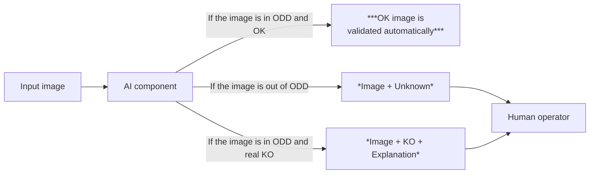

This markdown transcripts a web page that is part of the references provided by the European Thrustorthy AI Association
It is about Renault Welding inspection
One of the use cases promoted by the European Trustworthy AI Foundation, with the support of Renault Group

# Context
In the highly competitive automotive industry, quality control is essential to ensure the reliability of vehicles and user safety. A failure in quality control can severely jeopardize safety, result in significant financial costs, and cause substantial reputational damage to the company involved.

One of the challenges for Renault is to improve the reliability of quality control for welding seams in automotive body manufacturing. Currently, this inspection is consistently performed by a human operator due to the legal dimension related to user safety, but can have limitations, such as:

Inconsistent inspection results due to human error.
Detecting micro-defects in real-time.
Consuming manual inspections, slowing down production.
Costs of rework or recalls if defects go unnoticed.
The key challenge is to develop an AI-based solution that reduces the number of inspections required by the operator through automated pre-validation, speed up inspections, lowering costs by minimizing rew
ork and recalls. For defect identification, the system should provide the operator with relevant information on the location of the detected defect in the image, hence reducing the control task duration.

# Description
A vehicle has many welding seams located at different positions on the vehicle chassis. These welding-seams are named c_X.

A weld can have two distinct states:
OK: The welding is normal.
KO: The welding has defects.

# Usecase objective (Intended purpose)
The objective is to develop an AI system capable of recognizing whether a welding is acceptable (OK) or not from a photo. A photo that is deemed not OK is always reviewed by the operator. Therefore, the goal is to maximize the number of normal welding that are correctly identified as OK, reducing the number of images that require operator review.

There are also safety constraints on the system's performance: a photo that is actually KO (not acceptable) must never be classified as OK to ensure it is always reviewed by the operator. Additionally, when a photo is classified as KO, the operator would like to receive information about where the defect was detected in the image to help reduce the time spent on the control task.

For images that the AI system cannot confidently classify, it can return an "Unknown" label, meaning the image will also be reviewed by the operator.

This functional behavior is illustrated in the figure below:

*The figure below illustrates the three decision paths of the AI component :*

# Operational Domain Design (ODD) Definition
The Operational Domain Design defines the set of input images for which the AI component is expected to return a predicted state.

Here are the conditions and environments in which the AI system is expected to operate effectively and safely:

- The luminosity of an image can be between 60 and 140 lumens.
- The level of blur (due to vibration of the production line) of an image can be variable.
- The orientation of welding seams can vary in the image with a rotation angle between -10° and 10°.
- The position of the piece in the image can be translated by 5 millimeters (corresponding to 100 pixels in the image depending on seams and camera position).
For images that are out of the ODD, the AI component shall return “UNKNOWN”, and the image is sent to the operator.

The operational constraints are as follows:

- False negative detections (defective welding qualified as OK by AI system) have a safety cost and shall imperatively be minimized. This is a primary objective.
- Maximize the accuracy of prediction.
- Some welding seams are more critical than others, depending on their position. The level of criticality impacts the cost of false negatives.

# Quality criteria
The AI component must consider several quality criteria:

- Operational cost metrics: Measure the financial gain (in euros) between a legacy system and the AI system.
- Uncertainty metrics: Measuring the ability of the model to use uncertainty to improve trustworthiness in its output.
- Robustness metrics: Measuring the ability of the model to be invariant to empirical perturbations on input images (blur, luminosity, rotation, translation).
- Monitoring metrics: Measuring the ability of the model to detect if the given input is within the ODD and adapt its output accordingly.
- Explainability metrics: Measuring the ability of the model to provide an explanation for its decision to help the operator save time during inspection.
More details about these different criteria will be provided in the coming weeks.

Dataset
The provided dataset has 114231 pictures in full HD (approximately 31 Go of data), with 12 different types of welding seams. These images are labelled to indicate if the welding is OK or KO. Most of images are in full HD resolution (1920*1080) but a part are in (960*540). This dataset is provided with an additional parquet file that contains metadata of all images.

a picture not provided here shows some examples of weldings OK and KO on two different welding seams c10 and c19.

The labeling of welding is done by two types of human annotators: "expert" and "operator. The welding state class, the welding-seams and the type of human annotator are described in a sample metadata file. See next section for detailed description of all available metadata.

# Detailed description of the meta data
All meta-information are stored in a parquet file named meta_ds.parquet stored in "metadata" folder in the dataset folder. A parquet can be seen as a file representing a dataframe. It can be opened with classical data-analysis python packages, like pandas or polars.

The metadata dataframe contains one row per sample, and the dataset includes the following columns:
| Column Name | Description |
|---|---|
| `sample_id` | Unique identifier for the sample. It has a syntax of type `"data_X"` |
| `class` | The real state of the welding present in the image; this is the ground truth. Two values are possible: `OK` or `KO` |
| `timestamp` | Datetime where the photo was taken; this shall not be useful in this challenge |
| `welding-seams` | The name of the welding seam to which the welding belongs. The welding-seams are named `"c_X"` |
| `labelling_type` | Type of human who annotated the data. Two possible values: `"expert"` or `"operator"` |
| `resolution` | Resolution information of the image `[width, height]` |
| `path` | Internal path of the image in the challenge storage |
| `sha256` | SHA256 of the image. It's a unique hexadecimal key representing image data. Used to detect alteration or corruption on the storage |
| `storage_type` | Type of storage where sample is stored: `"s3"` or `"filesystem"` |
| `data-origin` | Type of data. Two possible values: `"real"` or `"synthetic"` |
| `blur_level` | Level of blur on the image. The measure was made numerically using OpenCV library |
| `blur_class` | Class of blur deduced from blur_level field. Two classes: `"blur"` and `"clean"` |
| `luminosity_level` | Luminosity of the image, measured numerically |
| `external_path` | URL of the image. This URL shall be used by challengers to directly download the sample from storage |
| `OOD_score` | Numerical measure of OOD score for the image |
| `OOD_class` | OOD class labelled by human |
| `bbox_coord` | Coordinates of a bounding box delimiting the weld area on the image. Format: `[(x_min,y_min),(x_max,y_max)]` where `(x_min,y_min)` is the upper left corner and `(x_max,y_max)` the lower right corner. Available for 90% of the dataset only |
| `transfo_order` | For synthetic datasets: order of applied multiple perturbations |
| `source_image_id` | For synthetic datasets: source `image_id` from which the current image was generated |
| `blur_gen_params` | For synthetic datasets: target level of blur in generation process |
| `luminosity_gen_params` | For synthetic datasets: target level of luminosity in generation process |
| `rotation_gen_params` | For synthetic datasets: target level of rotation in generation process |

Dataset structure
The list of all available datasets is accessible in the yaml file named datasets_list.yml located at the root of the storage. It contains the names of all datasets included in the challenge (ds_name_1, ds_name_2 ..).

There is one subfolder by dataset. In each dataset folder, images are organized hierarchically based on the following fields: welding-seams -> human_annotator.

Each dataset has a metadata folder containing a single parquet file named meta_ds.parquet with all meta information of all sample present in the dataset.

Thus, the datasets storage has the following structure:

.
├── datasets_list.yml
├── datasets
│   ├── ds_name_1
│   │   ├── metadata
│   │   |   |──meta_ds.parquet
│   │   ├── cX
│   │   │   │── expert
│   │   │   │   |── sample_X.jpeg
│   │   │   │   |── sample_Y.jpeg
│   │   │   │   |── sample_Z.jpeg
│   │   │   │   |── ..
│   │   │   │── operator
│   │   │   │   |── sample_X.jpeg
│   │   │   │   |── sample_Y.jpeg
│   │   │   │   |── sample_Z.jpeg
│   │   │   │   |── ..
│   │   ├── cY
│   │   │   │── expert
│   │   │   │   |── sample_X.jpeg
│   │   │   │   |── sample_Y.jpeg
│   │   │   │   |── sample_Z.jpeg
│   │   │   │   |── ..
|         ..
│   ├── ds_name_2
│   │   ├── metadata
│   │   |   |──meta_ds.parquet
│   │   ├── c102
│   │   │   │── expert
│   │   │   │   |── sample_X.jpeg
│   │   │   │   |── sample_Y.jpeg
│   │   │   │   |── sample_Z.jpeg
│   │   │   │   |── ..
│   │   │   │── operator
│   │   │   │   |── sample_X.jpeg
│   │   │   │   |── sample_Y.jpeg
│   │   │   │   |── sample_Z.jpeg
│   │   │   │   |── ..
│   │   ├── c27.2
│   │   │   │── labelling-type
│   │   │   │   |── sample_X.jpeg
│   │   │   │   |── sample_Y.jpeg
│   │   │   │   |── sample_Z.jpeg
│   │   │   │   |── ..
Dataset global statistics
Number of samples : 114321 images

76528 images in full HD resolution (1920*1080)
38202 images in resolution (960*540)
class repartition:

OK: 98,60 %
KO: 1.40 %